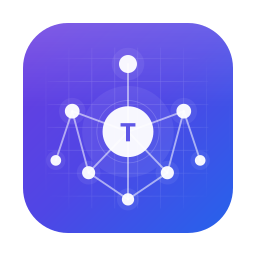
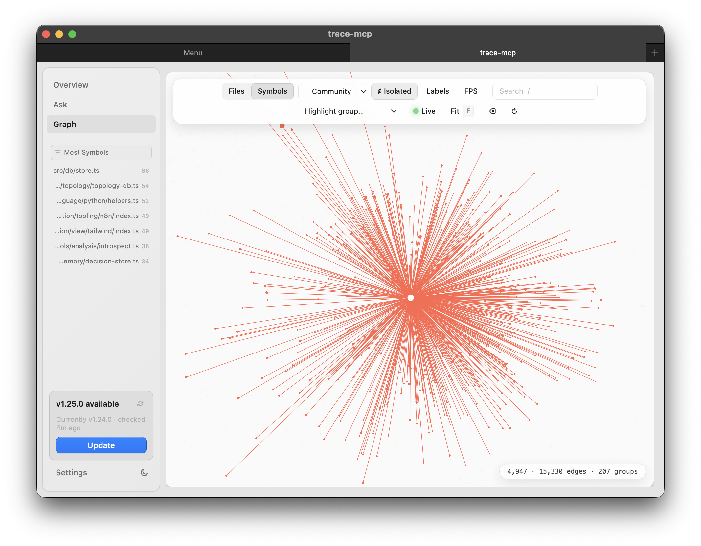
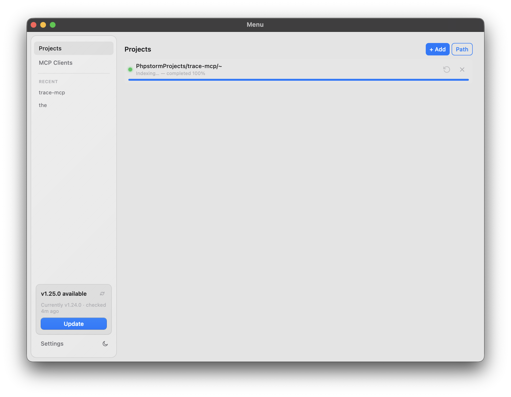
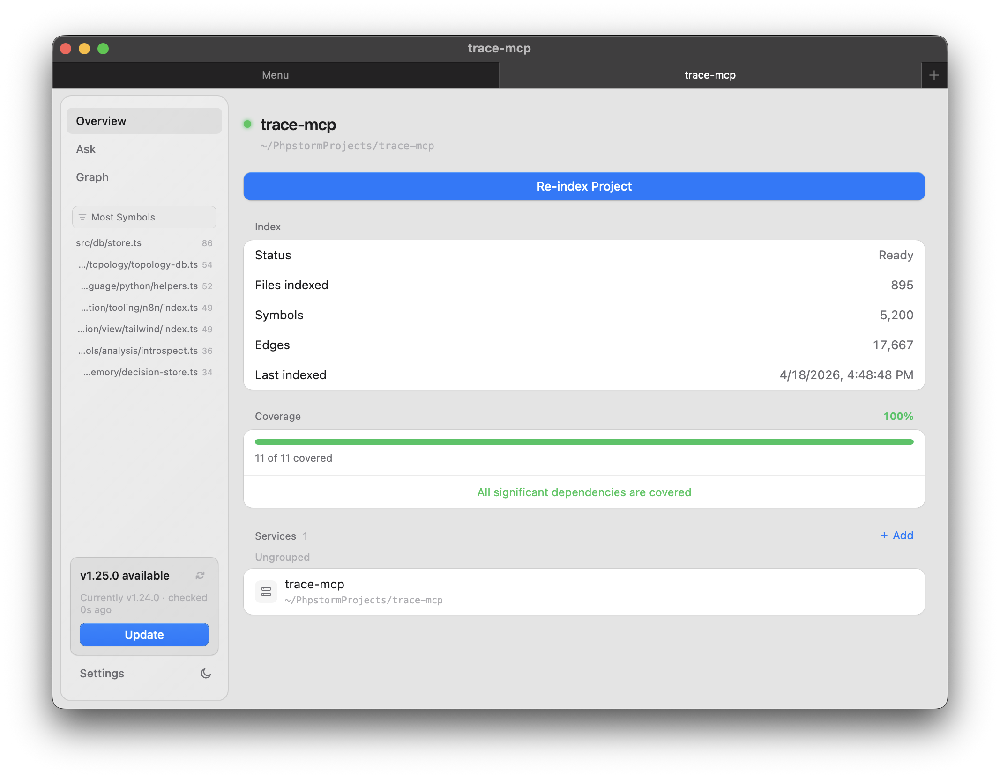
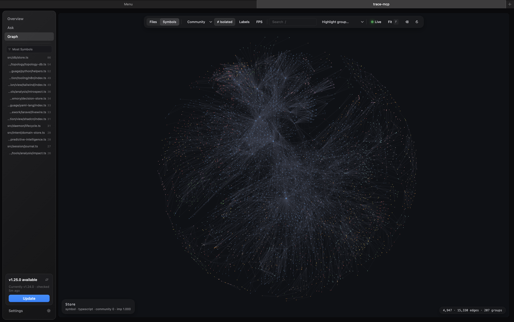

<p align="center">
  
</p>

<h1 align="center">trace-mcp</h1>

<p align="center">
  <a href="https://glama.ai/mcp/servers/nikolai-vysotskyi/trace-mcp"></a>
  <a href="https://www.npmjs.com/package/trace-mcp"></a>
  
  <a href="LICENSE"></a>
</p>

<p align="center">
  <strong>MCP server for Claude Code and Codex. One tool call replaces ~42 minutes of agent exploration — 80 Grep calls, 190 file reads.</strong>
</p>

> Your AI agent reads `UserController.php` and sees a class.
> trace-mcp reads it and sees a route → controller → Eloquent model → Inertia render → Vue page — **in one graph.**
>
> Ask *"what breaks if I change this model?"* — instead of 80 Grep calls and 190 file reads, the agent calls `get_change_impact` once and gets the blast radius across PHP, Vue, migrations, and DI. 58 framework integrations across 81 languages, 138 tools, up to 99% token reduction.

<p align="center">
  
  <br/>
  <sub>Also ships a <a href="#desktop-app">desktop app</a> with a GPU graph explorer over the same index.</sub>
</p>

---

## What trace-mcp does for you

| You ask | trace-mcp answers | How |
|---|---|---|
| "What breaks if I change this model?" | Blast radius across languages + risk score + linked architectural decisions | `get_change_impact` — reverse dependency graph + decision memory |
| "Why was auth implemented this way?" | The actual decision record with reasoning and tradeoffs | `query_decisions` — searches the decision knowledge graph linked to code |
| "I'm starting a new task" | Optimal code subgraph + relevant past decisions + dead-end warnings | `plan_turn` — opening-move router with decision enrichment |
| "What did we discuss about GraphQL last month?" | Verbatim conversation fragments with file references | `search_sessions` — FTS5 search across all past session content |
| "Show me the request flow from URL to rendered page" | Route → Middleware → Controller → Service → View with prop mapping | `get_request_flow` — framework-aware edge traversal |
| "Find all untested code in this module" | Symbols classified as "unreached" or "imported but never called in tests" | `get_untested_symbols` — test-to-source mapping |
| "What's the impact of this API change on other services?" | Cross-subproject client calls with confidence scores | `get_subproject_impact` — topology graph traversal |

**Three things no other tool does:**

1. **Framework-aware edges** — trace-mcp understands that `Inertia::render('Users/Show')` connects PHP to Vue, that `@Injectable()` creates a DI dependency, that `$user->posts()` means a `posts` table from migrations. 58 integrations across 15 frameworks, 7 ORMs, 13 UI libraries.

2. **Code-linked decision memory** — when you record "chose PostgreSQL for JSONB support", it's linked to `src/db/connection.ts::Pool#class`. When someone runs `get_change_impact` on that symbol, they see the decision. MemPalace stores decisions as text; trace-mcp ties them to the dependency graph.

3. **Cross-session intelligence** — past sessions are mined for decisions and indexed for search. When you start a new session, `get_wake_up` gives you orientation in ~300 tokens; `plan_turn` shows relevant past decisions for your task; `get_session_resume` carries over structural context from previous sessions.

---

## The problem

AI coding agents are language-aware but **framework-blind**.

They don't know that `Inertia::render('Users/Show', $data)` connects a Laravel controller to `resources/js/Pages/Users/Show.vue`. They don't know that `$user->posts()` means the `posts` table defined three migrations ago. They can't trace a request from URL to rendered pixel.

So they brute-read files, guess at relationships, and miss cross-language edges entirely. The bigger the project, the worse it gets.

## The solution

trace-mcp builds a **cross-language dependency graph** from your source code and exposes it through the [Model Context Protocol](https://modelcontextprotocol.io) — the plugin format Claude Code, Cursor, Windsurf and other AI coding agents speak. Any MCP-compatible agent gets framework-level understanding out of the box.

| Without trace-mcp | With trace-mcp |
|---|---|
| Agent reads 15 files to understand a feature | `get_task_context` — optimal code subgraph in one shot |
| Agent doesn't know which Vue page a controller renders | `routes_to → renders_component → uses_prop` edges |
| "What breaks if I change this model?" — agent guesses | `get_change_impact` traverses reverse dependencies across languages |
| Schema? Agent needs a running database | Migrations parsed — schema reconstructed from code |
| Prop mismatch between PHP and Vue? Discovered in production | Detected at index time — PHP data vs. `defineProps` |

---

<a id="desktop-app"></a>

## Desktop app

trace-mcp ships with an optional Electron desktop app (`packages/app`) that gives you a visual surface over the same index the MCP server uses. It manages multiple projects, wires up MCP clients, and provides a GPU-accelerated graph explorer — all without opening a terminal.

<p align="center">
  
</p>

**Projects & clients.** The menu window lists indexed projects with live status (`Ready` / indexing / error) and re-index / remove controls. The **MCP Clients** tab detects installed clients (Claude Code, Claw Code, Claude Desktop, Cursor, Windsurf, Continue, Junie, JetBrains AI, Codex) and wires trace-mcp into them with one click, including enforcement level (Base / Standard / Max — CLAUDE.md only, + hooks, + tweakcc).

<p align="center">
  
</p>

**Per-project overview.** Each project opens in its own tabbed window: **Overview** (files, symbols, edges, coverage, linked services, re-index), **Ask** (natural-language query over the index), and **Graph**. Overview also surfaces `Most Symbols` files, last-indexed timestamp, and the dependency coverage meter.

**GPU graph explorer.** The Graph tab renders the full dependency graph on the GPU via [cosmos.gl](https://cosmos.gl) — tens of thousands of nodes/edges at interactive frame rates. Filter by Files / Symbols, overlay detected communities, highlight groups, toggle labels/FPS, and step through graph depth. Good for getting a feel for coupling, hotspots, and how a codebase is actually shaped before you dive into tools.

<p align="center">
  
</p>

**Install:** grab the latest build from [Releases](https://github.com/nikolai-vysotskyi/trace-mcp/releases/latest) —

- **macOS** — `trace-mcp-<version>-arm64-mac.zip` (Apple Silicon) or `trace-mcp-<version>-mac.zip` (Intel). Unzip and drag `trace-mcp.app` into `/Applications`.
- **Windows** — run `trace-mcp.Setup.<version>.exe`.

The app talks to the same `trace-mcp` daemon (`http://127.0.0.1:3741`) that MCP clients use, so anything you index from the app is immediately available to Claude Code / Cursor / etc.

---

## How trace-mcp compares

trace-mcp combines **code graph navigation**, **cross-session memory**, and **real-time code understanding** in a single tool. Most adjacent projects solve one of these — trace-mcp unifies all three and is the only one with **framework-aware cross-language edges** (58 integrations) and **code-linked decision memory**.

- **vs. token-efficient exploration** (Repomix, jCodeMunch, cymbal) — trace-mcp adds framework edges, refactoring, security, and subprojects on top of symbol lookup.
- **vs. session-memory tools** (MemPalace, claude-mem, ConPort) — trace-mcp links decisions to specific symbols/files, so they surface automatically in impact analysis.
- **vs. RAG / doc-gen** (DeepContext, smart-coding-mcp) — trace-mcp answers "show me the execution path, deps, and tests," not "find code similar to this query."
- **vs. code-graph MCP servers** (Serena, Roam-Code) — trace-mcp has the broadest language coverage (81) and is the only one with cross-language framework edges.

> Full side-by-side tables with GitHub stars, languages, and per-capability coverage: [docs/comparisons.md](docs/comparisons.md).

---

## Up to 99% token reduction — real-world benchmark

AI agents burn tokens reading files they don't need. trace-mcp returns **precision context** — only the symbols, edges, and signatures relevant to the query.

**Benchmark: trace-mcp's own codebase** (694 files, 3,831 symbols):

```
Task                  Without trace-mcp    With trace-mcp    Reduction
─────────────────────────────────────────────────────────────────────
Symbol lookup              42,518 tokens     7,353 tokens      82.7%
File exploration           27,486 tokens       548 tokens      98.0%
Search                     22,860 tokens     8,000 tokens      65.0%
Find usages                11,430 tokens     1,720 tokens      85.0%
Context bundle             12,847 tokens     4,164 tokens      67.6%
Batch overhead             16,831 tokens     9,031 tokens      46.3%
Impact analysis            49,141 tokens     2,461 tokens      95.0%
Call graph                178,345 tokens    10,704 tokens      94.0%
Type hierarchy             94,762 tokens     1,030 tokens      98.9%
Tests for                  22,590 tokens     1,150 tokens      94.9%
Composite task             93,634 tokens     3,836 tokens      95.9%
─────────────────────────────────────────────────────────────────────
Total                     572,444 tokens    49,997 tokens      91.3%
```

**91% fewer tokens** to accomplish the same code understanding tasks. That's ~522K tokens saved per exploration session — more headroom for actual coding, fewer context window evictions, lower API costs.

**Savings scale with project size.** On a 650-file project, trace-mcp saves ~522K tokens. On a 5,000-file enterprise codebase, savings grow **non-linearly** — without trace-mcp, the agent reads more wrong files before finding the right one. With trace-mcp, graph traversal stays O(relevant edges), not O(total files).

**Composite tasks deliver the biggest wins.** A single `get_task_context` call replaces a chain of ~10 sequential operations (search → get_symbol × 5 → Read × 3 → Grep × 2). That's **one round-trip instead of ten**, with 90%+ token reduction.

<details>
<summary>Methodology</summary>

Measured using `benchmark_project` — runs eleven real task categories (symbol lookup, file exploration, text search, find usages, context bundle, batch overhead, impact analysis, call graph traversal, type hierarchy, tests-for, composite task context) against the indexed project. "Without trace-mcp" = estimated tokens from equivalent Read/Grep/Glob operations (full file reads, grep output). "With trace-mcp" = actual tokens returned by trace-mcp tools (targeted symbols, outlines, graph results). Token counts estimated using trace-mcp's built-in savings tracker.

Reproduce it yourself:
```
# Via MCP tool
benchmark_project  # runs against the current project

# Or via CLI
trace-mcp benchmark /path/to/project
```
</details>

---

## Key capabilities

- **Request flow tracing** — URL → Route → Middleware → Controller → Service, across backend frameworks
- **Component trees** — render hierarchy with props / emits / slots (Vue, React, Blade)
- **Schema from migrations** — no DB connection needed
- **Event chains** — Event → Listener → Job fan-out (Laravel, Django, NestJS, Celery, Socket.io)
- **Change impact analysis** — reverse dependency traversal across languages, enriched with linked architectural decisions
- **Graph-aware task context** — describe a dev task → get the optimal code subgraph (execution paths, tests, types) + relevant past decisions, adapted to bugfix/feature/refactor intent
- **Call graph & DI tree** — bidirectional call graphs with 4-tier resolution confidence, optional LSP enrichment for compiler-grade accuracy, NestJS dependency injection
- **ORM model context** — relationships, schema, metadata for 7 ORMs
- **Dead code & test gap detection** — find untested exports/symbols (with "unreached" vs "imported_not_called" classification), dead code, per-symbol test reach in impact analysis
- **Security scanning** — OWASP Top-10 pattern scanning and taint analysis (source→sink data flow). Exportable MCP-server security context for [skill-scan](https://github.com/kkdub/skill-scan)
- **Semantic search, offline by default** — bundled ONNX embeddings work out of the box, no API keys; switch to Ollama/OpenAI for LLM-powered summarisation
- **[Decision memory](#decision-memory)** — mine sessions for decisions, link them to symbols/files, auto-surface in impact analysis
- **[Multi-service subprojects](#subprojects)** — link graphs across services via API contracts; cross-service impact + service-scoped decisions
- **[CI/PR change impact reports](#cipr-change-impact-reports)** — automated blast radius, risk scoring, test-gap detection, architecture violations on every PR

### Supported stack

**Languages (81):** PHP, TypeScript, JavaScript, Python, Go, Java, Kotlin, Ruby, Rust, C, C++, C#, Swift, Objective-C, Objective-C++, Dart, Scala, Groovy, Elixir, Erlang, Haskell, Gleam, Bash, Lua, Perl, GDScript, R, Julia, Nix, SQL, PL/SQL, HCL/Terraform, Protocol Buffers, GraphQL, Prisma, Vue SFC, HTML, CSS/SCSS/SASS/LESS, XML/XUL/XSD, YAML, JSON, TOML, Assembly, Fortran, AutoHotkey, Verse, AL, Blade, EJS, Zig, OCaml, Clojure, F#, Elm, CUDA, COBOL, Verilog/SystemVerilog, GLSL, Meson, Vim Script, Common Lisp, Emacs Lisp, Dockerfile, Makefile, CMake, INI, Svelte, Markdown, MATLAB, Lean 4, FORM, Magma, Wolfram/Mathematica, Ada, Apex, D, Nim, Pascal, PowerShell, Solidity, Tcl

**Frameworks:** Laravel (+ Livewire, Nova, Filament, Pennant), Django (+ DRF), FastAPI, Flask, Express, NestJS, Fastify, Hono, Next.js, Nuxt, Rails, Spring, tRPC

**ORMs:** Eloquent, Prisma, TypeORM, Drizzle, Sequelize, Mongoose, SQLAlchemy

**Frontend:** Vue, React, React Native, Blade, Inertia, shadcn/ui, Nuxt UI, MUI, Ant Design, Headless UI

**Other:** GraphQL, Socket.io, Celery, Zustand, Pydantic, Zod, n8n, React Query/SWR, Playwright/Cypress/Jest/Vitest/Mocha

> Full details: [Supported frameworks](docs/supported-frameworks.md) · [All tools](docs/tools-reference.md)

---

## Quick start

```bash
npm install -g trace-mcp
trace-mcp init        # one-time global setup (MCP clients, hooks, CLAUDE.md)
trace-mcp add         # register current project for indexing
```

- `init` — configures your MCP client (Claude Code, Cursor, Windsurf, Claude Desktop, …), installs the guard hook, adds routing rules to `~/.claude/CLAUDE.md`.
- `add` — detects frameworks, creates the per-project index, registers the project. Re-run in every project you want trace-mcp to understand.

All state lives in `~/.trace-mcp/` — your project directory stays clean unless you opt into `.traceignore` or `.trace-mcp/.config.json`.

Then in your MCP client:

```
> get_project_map to see what frameworks are detected
> get_task_context("fix the login bug") to get full execution context for a task
> get_change_impact on app/Models/User.php to see what depends on it
```

> Prefer a GUI? The [desktop app](#desktop-app) handles install, indexing, MCP-client wiring, and re-indexing without touching a terminal.

**Going further:** [adding more projects / upgrading / manual setup](docs/configuration.md#cli) · [semantic search (local ONNX)](docs/configuration.md#ai-configuration) · [indexing & file watcher](docs/configuration.md#how-config-works) · [`.traceignore`](docs/configuration.md#traceignore).

---

## Getting the most out of trace-mcp

trace-mcp works on three levels to make AI agents use its tools instead of raw file reading:

### Level 1: Automatic (works out of the box)

The MCP server provides **instructions** and **tool descriptions** with routing hints that tell AI agents when to prefer trace-mcp over native Read/Grep/Glob. This works with any MCP-compatible client — no configuration needed.

### Level 2: CLAUDE.md (recommended)

`trace-mcp init` adds a Code Navigation Policy block to `~/.claude/CLAUDE.md` (or your project's `CLAUDE.md`) that tells the agent which trace-mcp tool to prefer over Read/Grep/Glob for each kind of task. If you skipped init, see [System prompt routing](docs/tweakcc.md) for the full block and how to tune enforcement.

### Level 3: Hook enforcement (Claude Code only)

For hard enforcement, `trace-mcp init` installs a **PreToolUse guard hook** that blocks Read/Grep/Glob on source files and redirects the agent to trace-mcp tools (non-code files, Read-before-Edit, and safe Bash commands pass through). Manage manually with `trace-mcp setup-hooks --global` / `--uninstall`. Details: [System prompt routing](docs/tweakcc.md).

---

<a id="decision-memory"></a>

## Decision memory

Decisions, tradeoffs, and discoveries from AI-agent conversations usually vanish when the session ends. trace-mcp captures them and **links each decision to the code it's about** — so when someone later runs `get_change_impact` on `src/db/connection.ts::Pool#class`, the "we chose PostgreSQL for JSONB" decision surfaces automatically.

- **Mine** — `mine_sessions` scans Claude Code / Claw Code JSONL logs and extracts decisions via pattern matching (0 LLM calls). Types: architecture, tech choice, bug root cause, tradeoff, convention.
- **Link** — each decision attaches to a symbol or file; supports service-scoped decisions for subprojects.
- **Surface** — decisions auto-enrich `get_change_impact`, `plan_turn`, and `get_session_resume`. Temporal validity (`valid_from`/`valid_until`) makes "what was true on 2025-01-15?" queries possible.
- **Search** — `query_decisions` (FTS5 + filters) for decisions; `search_sessions` for raw conversation content across all past sessions.

```bash
trace-mcp memory mine                           # extract decisions from sessions
trace-mcp memory search "GraphQL migration"     # search past conversations
trace-mcp memory timeline --file src/auth.ts    # decision history for a file
```

> Full tool list, CLI, temporal validity, service scoping: [Decision memory](docs/decision-memory.md).

---

<a id="subprojects"></a>

## Subprojects

A **subproject** is any repo in your project's ecosystem — microservice, frontend, shared lib, CLI tool. trace-mcp **links dependency graphs across subprojects**: if service A calls an endpoint in service B, changing the endpoint in B shows up as a breaking change for A.

Discovery is automatic. On each index, trace-mcp detects subprojects (Docker Compose, flat/grouped workspaces, monolith fallback), parses API contracts (OpenAPI, GraphQL SDL, Protobuf/gRPC), scans code for HTTP client calls (fetch, axios, `Http::`, `requests`, `http.Get`, gRPC stubs, GraphQL ops), and links the calls to known endpoints.

```bash
cd ~/projects/my-app && trace-mcp add
# → auto-detects user-service (openapi.yaml) and order-service
# → links order-service → user-service via /api/users/{id}

trace-mcp subproject impact --endpoint=/api/users
# → [order-service] src/services/user-client.ts:42 (axios, confidence: 85%)
```

External subprojects can be added manually with `trace-mcp subproject add --repo=... --project=...`. MCP tools: `get_subproject_graph`, `get_subproject_impact`, `get_subproject_clients`, `subproject_add_repo`, `subproject_sync`.

> Full CLI, detection modes, MCP-tool reference, topology config: [Configuration — topology & subprojects](docs/configuration.md#topology--subprojects).

---

<a id="cipr-change-impact-reports"></a>

## CI/PR change impact reports

`trace-mcp ci-report --base main --head HEAD` produces a markdown or JSON report per pull request: **summary, blast radius** (depth-2 reverse dep traversal), **test coverage gaps** (per-symbol `hasTestReach`), **risk analysis** (30% complexity + 25% churn + 25% coupling + 20% blast radius), **architecture violations** (auto-detects clean / hexagonal presets), and **new dead exports**.

Use `--fail-on high` to block merges on high-risk changes. See [`.github/workflows/ci.yml`](.github/workflows/ci.yml) for a ready-to-use GitHub Action that runs `build → test → impact-report` and posts a sticky PR comment on every push.

---

## How it works

```
Source files (PHP, TS, Vue, Python, Go, Java, Kotlin, Ruby, HTML, CSS, Blade)
    │
    ▼
┌──────────────────────────────────────────┐
│  Pass 1 — Per-file extraction            │
│  tree-sitter → symbols                   │
│  integration plugins → routes,           │
│    components, migrations, events,       │
│    models, schemas, variants, tests      │
└────────────────────┬─────────────────────┘
                     │
                     ▼
┌──────────────────────────────────────────┐
│  Pass 2 — Cross-file resolution          │
│  PSR-4 · ES modules · Python modules    │
│  Vue components · Inertia bridge         │
│  Blade inheritance · ORM relations       │
│  → unified directed edge graph           │
└────────────────────┬─────────────────────┘
                     │
                     ▼
┌──────────────────────────────────────────┐
│  Pass 3 — LSP enrichment (opt-in)       │
│  tsserver · pyright · gopls ·           │
│  rust-analyzer → compiler-grade         │
│  call resolution, 4-tier confidence     │
└────────────────────┬─────────────────────┘
                     │
                     ▼
┌──────────────────────────────────────────┐
│  SQLite (WAL mode) + FTS5               │
│  nodes · edges · symbols · routes       │
│  + embeddings (local ONNX by default)   │
│  + optional: LLM summaries              │
└────────────────────┬─────────────────────┘
                     │
                     ▼
┌──────────────────────────────────────────┐
│  Decision Memory (decisions.db)         │
│  decisions · session chunks · FTS5      │
│  temporal validity · code linkage       │
│  auto-mined from session logs           │
└────────────────────┬─────────────────────┘
                     │
                     ▼
         MCP server (stdio or HTTP/SSE)
         138 tools · 2 resources
```

**Incremental by default** — files are content-hashed; unchanged files are skipped on re-index.

**Plugin architecture** — language plugins (symbol extraction) and integration plugins (semantic edges) are loaded based on project detection, organized into categories: framework, ORM, view, API, validation, state, realtime, testing, tooling.

> Details: [Architecture & plugin system](docs/architecture.md)

---

## Documentation

| Document | Description |
|---|---|
| [Supported frameworks](docs/supported-frameworks.md) | Complete list of languages, frameworks, ORMs, UI libraries, and what each extracts |
| [Tools reference](docs/tools-reference.md) | All 138 MCP tools with descriptions and usage examples |
| [Configuration](docs/configuration.md) | Config options, AI setup, environment variables, security settings |
| [Architecture](docs/architecture.md) | How indexing works, plugin system, project structure, tech stack |
| [Decision memory](docs/decision-memory.md) | Decision knowledge graph, session mining, cross-session search, wake-up context |
| [Analytics](docs/analytics.md) | Session analytics, token savings tracking, optimization reports, benchmarks |
| [System prompt routing](docs/tweakcc.md) | Optional tweakcc integration for maximum tool routing enforcement |
| [Comparisons](docs/comparisons.md) | Full side-by-side tables vs. other code intelligence / memory / RAG tools |
| [Development](docs/development.md) | Building, testing, contributing, adding new plugins |

---

## License

[MIT](LICENSE)

---

Built by [Nikolai Vysotskyi](https://github.com/nikolai-vysotskyi)
